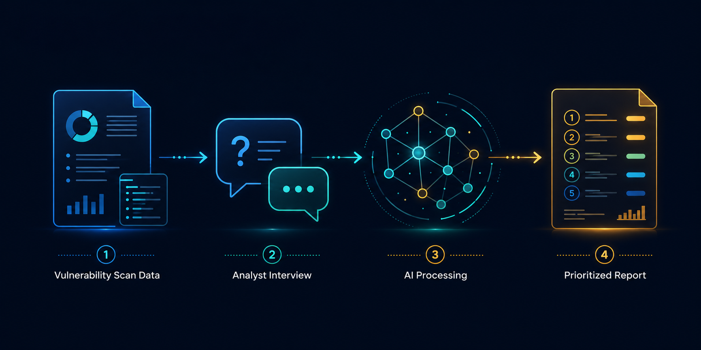
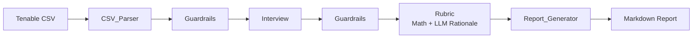

<p align="center">
  
</p>

<h1 align="center">VM Risk Agent</h1>

<p align="center">
  <em>Two organizations can get the same vulnerability scan but shouldn't get the same remediation plan. This agent reads the scan, asks about the organization, and ranks what to fix first.</em>
</p>

<div align="center">

`Python 3.10+` · `Anthropic API` · `Tenable Nessus` · `Azure`

</div>

---

## Overview

The VM Risk Agent reads a Tenable scan and a short analyst interview, then ranks the findings by what the organization needs to fix first. The rubric weighs CVSS against data sensitivity, asset criticality, defense maturity, and regulatory pressure. The same finding can land in different priority buckets depending on the organization. Scoring is computed deterministically in Python. Claude generates the rationale paragraph that explains each score in plain language, but the ranking is set by the formula, not the model.

---

## Lab Environment & Scan

The target system is a Windows 11 Pro virtual machine (`vm-risk-lab-01`) provisioned in Microsoft Azure for this project. Vulnerabilities were intentionally introduced via PowerShell, including configuration weaknesses (SMBv1 enabled, anonymous SMB share, RDP without Network Level Authentication, weak password policy, Guest account enabled, disabled Windows Defender) and outdated third-party software (Firefox ESR, 7-Zip, Microsoft Teams, Outlook, Microsoft Edge, Notepad).

A credentialed Tenable Nessus scan was run using local administrative credentials with a common-port scan policy. It surfaced **132 unique findings**: 16 Critical, 9 High, 3 Medium, 2 Low, and 102 Informational. The scored findings skew toward missing-patch issues in outdated software (Firefox ESR, 7-Zip, Microsoft Teams, Outlook, Microsoft Edge, Notepad) and disabled Windows Defender, because Tenable's patch audit catches version drift more aggressively than configuration drift. The 102 Informational entries describe the system's configuration state (SMB services, password policy, registry settings) rather than the planted vulnerabilities themselves. After the agent's cull rules apply, **27 findings** are scored and prioritized.

📄 **Tenable scan output:** [`VM-Risk-Lab.pdf`](Tenable_Results/VM-Risk-Lab.pdf) (executive summary) · [`VM-Risk-Lab.csv`](Tenable_Results/VM-Risk-Lab.csv) (raw scan data the agent parses)

| Severity | Count |
|---|---|
| 🔴 Critical | 16 |
| 🟠 High | 9 |
| 🟡 Medium | 3 |
| 🟢 Low | 2 |
| ⚪ Informational | 102 |
| **Total** | **132** |

---

## How It Works

The pipeline runs in six stages. A Tenable CSV is parsed into structured findings, then the analyst answers twelve questions about the organization. Guardrails sit at two checkpoints to catch unusable inputs before they propagate. The rubric scores each finding deterministically. Claude generates a rationale paragraph for each score, and the report writer produces a Markdown report.



---

## Rubric Design

The rubric combines four scoring components into a single score per finding: how likely the vulnerability is to be exploited, how much it would cost the organization if it were, how much existing defenses reduce that risk, and how much the organization's regulatory and operational pressures amplify it.

The final score is built up in five steps:

1. Start with the vulnerability's technical severity (CVSS, scaled 0 to 1).
2. Boost it based on whether an exploit exists and how exposed the asset is to the internet.
3. Multiply by how much the organization has to lose if this vulnerability is exploited (asset criticality, data sensitivity, impact type).
4. Reduce by how strong the organization's defenses are (patching, segmentation, detection, resilience).
5. Adjust for organizational pressure (regulation, uptime needs, recent incidents).

<details>
<summary><strong>The actual formula</strong></summary>

```
cvss_norm        = CVSS / 10
headroom         = 1.0 - cvss_norm
base_likelihood  = min(1.0, cvss_norm + headroom × (exposure_boost + exploit_boost))
material_cost    = (asset × 0.4) + (data × 0.4) + (CIA × 0.2)
raw_score        = base_likelihood × material_cost
adjusted_score   = raw_score × (1 - defense_adjustment)
final_score      = adjusted_score × org_context_modifier
```

</details>

📄 **Full design report:** [`VM_Risk_Agent_Rubric_Design.pdf`](Docs/VM_Risk_Agent_Rubric_Design.pdf) 

---

## Results: Four Scenarios, Same Scan

The agent was tested against four organizational scenarios using the same Tenable scan: a hospital, a SaaS startup, a small clinic, and a mom-and-pop bookkeeping shop. Each scenario's interview produced a different scoring profile, validating that the rubric responds to organizational context rather than just CVSS. Click any scenario below for the full breakdown.

The table below shows how Tenable originally classified the 30 non-informational findings (Critical, High, Medium, Low) and how each scenario re-bucketed them after the agent applied its scoring rubric. The totals differ slightly because the agent's cull rules drop a few low-relevance findings before scoring (informational severity, CVSS below 4.0 with no exploit, or out-of-scope).

| Scenario | Critical | High | Medium | Low | Total |
|---|---|---|---|---|---|
| **Tenable (baseline)** | 16 | 9 | 3 | 2 | 30 |
| 🏥 Hospital | 5 | 22 | 0 | 0 | 27 |
| ☁️ SaaS Startup | 0 | 0 | 27 | 0 | 27 |
| 🩺 Small Clinic | 24 | 3 | 0 | 0 | 27 |
| 🏪 Mom-and-Pop (Tax/Bookkeeping Shop) | 26 | 1 | 0 | 0 | 27 |

> **Note:** Each scenario's dropdown below highlights three findings: the highest-scoring overall plus two more chosen to show how exploit availability and CVSS interact with org context. The highest-scoring entry across every scenario is one of 16 Mozilla Firefox ESR plugins from consecutive versions of the same product. The dropdowns show the highest-scoring plugin as the cluster's representative; the linked report shows all 16.

<details>
<summary><strong>🏥 Hospital — Regulated, internet-facing, mid defenses, recent incident</strong></summary>

**Org context:** A regional hospital running 24/7 patient care on internet-facing systems holding HIPAA-regulated patient records. Mid-maturity patching and resilience, strong segmentation and detection. Suffered a security incident within the past 24 months.

**Top findings:**
1. `[167637]` Mozilla Firefox ESR < 102.5 (CVSS 9.8, no exploit) — **71/100** 🔴 Critical
2. `[166555]` WinVerifyTrust Signature Validation (CVSS 8.8, Metasploit available) — **67/100** 🟠 High
3. `[298646]` Microsoft Notepad Command Injection (CVSS 7.8, Metasploit available) — **61/100** 🟠 High

**What drove the prioritization:** The hospital's regulated data and recent incident pushed material cost and the org context modifier (1.125) to the top of the scale. A defense adjustment of 0.354 (driven by strong segmentation and detection, mid-maturity patching) pulled the top Firefox finding to 71/100. Metasploit-flagged findings like WinVerifyTrust and Notepad clustered just below the Firefox group because their lower CVSS gave the exploit boost less headroom to work with. Five findings landed Critical, the remaining 22 stacked into High.

📄 [Full report](Hospital_Scenario/report_hospital.md) · [Terminal log](Hospital_Scenario/report_hospital_terminal.txt)

</details>

<details>
<summary><strong>☁️ SaaS Startup — Internal data, internet-facing, strong defenses</strong></summary>

**Org context:** A B2B SaaS startup running internet-facing services holding internal business data (not regulated). High-uptime operation. Strong patching, segmentation, detection, and a medium-maturity resilience program. No recent incidents.

**Top findings:**
1. `[167637]` Mozilla Firefox ESR < 102.5 (CVSS 9.8, no exploit) — **44/100** 🟡 Medium
2. `[166555]` WinVerifyTrust Signature Validation (CVSS 8.8, Metasploit available) — **41/100** 🟡 Medium
3. `[298646]` Microsoft Notepad Command Injection (CVSS 7.8, Metasploit available) — **38/100** 🟡 Medium

**What drove the prioritization:** Internal (not regulated) data and the absence of recent incidents pulled the org context modifier below 1.0 (0.985), the only scenario where context lowers rather than amplifies the score. A strong defense adjustment of 0.46 reflected high-maturity controls across all four dimensions. The top Firefox finding scored 44/100, less than half the Mom-and-Pop equivalent. Every one of the 27 scored findings landed in Medium. Metasploit-flagged findings clustered just below the no-exploit Firefox finding because the strong defenses absorbed most of the exploit-availability boost.

📄 [Full report](SAAS_Scenario/report_saas.md) · [Terminal log](SAAS_Scenario/report_saas_terminal.txt)

</details>

<details>
<summary><strong>🩺 Small Clinic — Regulated, internal-only, weak defenses</strong></summary>

**Org context:** A small private clinic running standard business-hours operation on internal-only systems holding HIPAA-regulated patient data. Weak patching, segmentation, and detection. No recent incidents.

**Top findings:**
1. `[167637]` Mozilla Firefox ESR < 102.5 (CVSS 9.8, no exploit) — **88/100** 🔴 Critical
2. `[166555]` WinVerifyTrust Signature Validation (CVSS 8.8, Metasploit available) — **81/100** 🔴 Critical
3. `[298646]` Microsoft Notepad Command Injection (CVSS 7.8, Metasploit available) — **74/100** 🔴 Critical

**What drove the prioritization:** Regulated data (HIPAA) and the heavy regulatory pressure pushed the org context modifier to 1.125, the same as the Hospital. The defense adjustment was only 0.05 because no defense sub-items were selected across patching, segmentation, or detection. With almost no defensive offset, the top Firefox finding scored 88/100, the second-highest of any scenario. 24 findings landed Critical and 3 in High. Even Metasploit-flagged findings hit Critical because their CVSS-and-org-context combination cleared the threshold easily.

📄 [Full report](Clinic_Scenario/report_clinic.md) · [Terminal log](Clinic_Scenario/report_clinic_terminal.txt)

</details>

<details>
<summary><strong>🏪 Mom-and-Pop (Tax/Bookkeeping Shop) — Regulated data, weak defenses, unknown exposure</strong></summary>

**Org context:** A small family-run tax and bookkeeping business. The interview was completed by someone without full visibility into the technical setup, exercising the agent's free-form override and "unsure" answer paths. Regulated client data, weak defenses across the board, exposure interpreted conservatively from the analyst's description.

**Top findings:**
1. `[167637]` Mozilla Firefox ESR < 102.5 (CVSS 9.8, no exploit) — **93/100** 🔴 Critical
2. `[166555]` WinVerifyTrust Signature Validation (CVSS 8.8, Metasploit available) — **86/100** 🔴 Critical
3. `[298646]` Microsoft Notepad Command Injection (CVSS 7.8, Metasploit available) — **79/100** 🔴 Critical

**What drove the prioritization:** The free-form override "we handle clients' tax returns and bookkeeping" was interpreted as heavy regulatory pressure, pushing the org context modifier to 1.125. The "not sure" response on exposure with context ("the computer is in the office and connects to the internet but I don't know if it's reachable from outside") was conservatively interpreted as DMZ. Weak defenses across patching, segmentation, and detection produced a defense adjustment of 0.0, the lowest of any scenario. With no defensive offset and inferred-conservative inputs, the top Firefox finding scored 93/100, the highest of all four scenarios. 26 findings landed Critical and 1 in High. The rationale text explicitly flagged the inferred answers and recommended re-verification, demonstrating the confidence-scoring layer working as designed.

📄 [Full report](MomAndPop_Scenario/report_momandpop.md) · [Terminal log](MomAndPop_Scenario/report_momandpop_terminal.txt)

</details>

---

## How to Run

### Prerequisites
- Python 3.10+
- An Anthropic API key
- A Tenable VM scan exported as CSV

### Setup
Clone the repo, set up a virtual environment, install `anthropic`, and create `code/keys.py` containing:
```python
ANTHROPIC_API_KEY = "sk-ant-..."
```

### Run
From the `code/` directory:
```bash
python3 main.py "../Tenable_Results/VM-Risk-Lab.csv"
```

The interview will start. After the twelve questions, the agent calls the LLM once per scored finding (about 90 seconds for a 27-finding scan) and writes a Markdown report.

<details>
<summary><strong>Optional flags</strong></summary>

- `--no-rationales` : skip LLM calls and output math only. Free, fast, useful for pipeline testing.
- `--scan-name "..."` : label shown in the report header.
- `--analyst "..."` : analyst name shown in the report header.
- `--output filename.md` : custom output path.

</details>

---

<p align="center">
  <strong>VM Risk Agent</strong> · v1.0.0<br>
  Built by <a href="https://github.com/k-isaacs">Keisha Isaacs</a>
</p>
